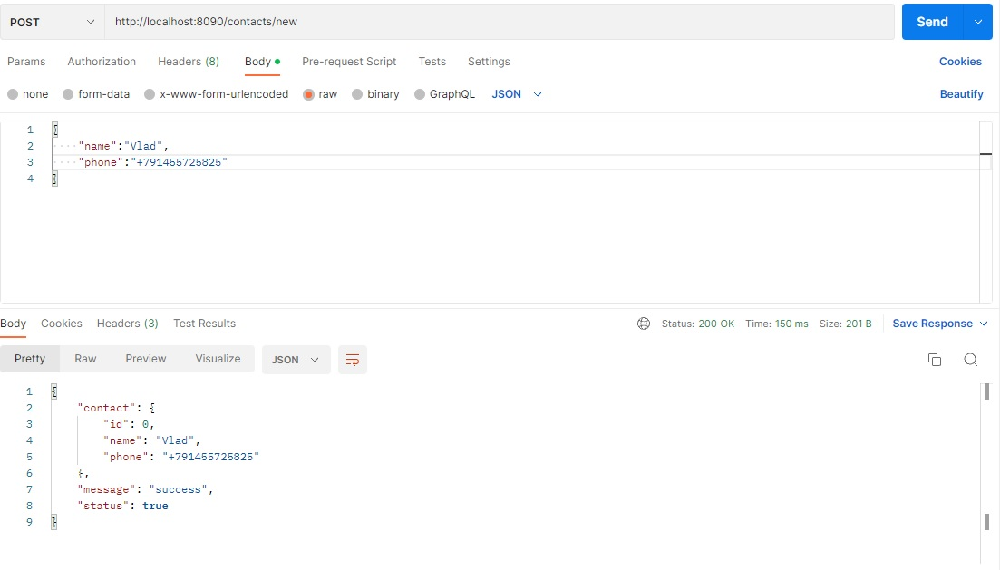
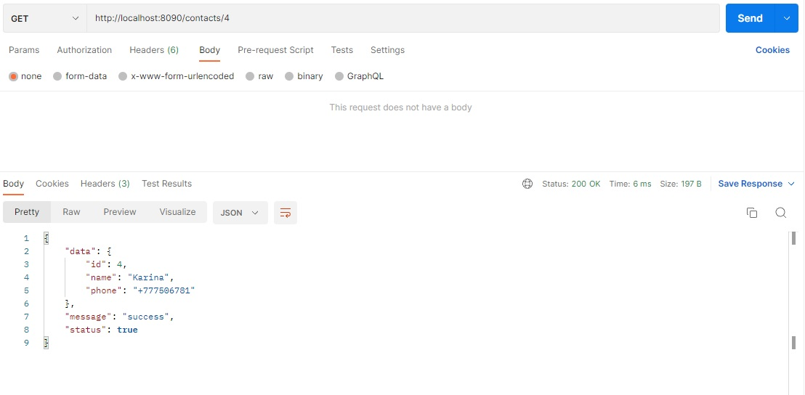

# Golang HttpServer

-Простой REST API для записи контактов и получения списка контактов

 

-Конфигурация: database PostgreSQL, requests in SQL.

 

    
Скриншоты операций в Postman:

    
    
    
    

 

-Для того, чтобы запустить приложение на вашем хосте, вам необходимо создать файл <i>.env</i> в корневой папке 
проекта с данными для подключения к БД (шаблон - файл <i>.env.origin</i>
в той же папке)

